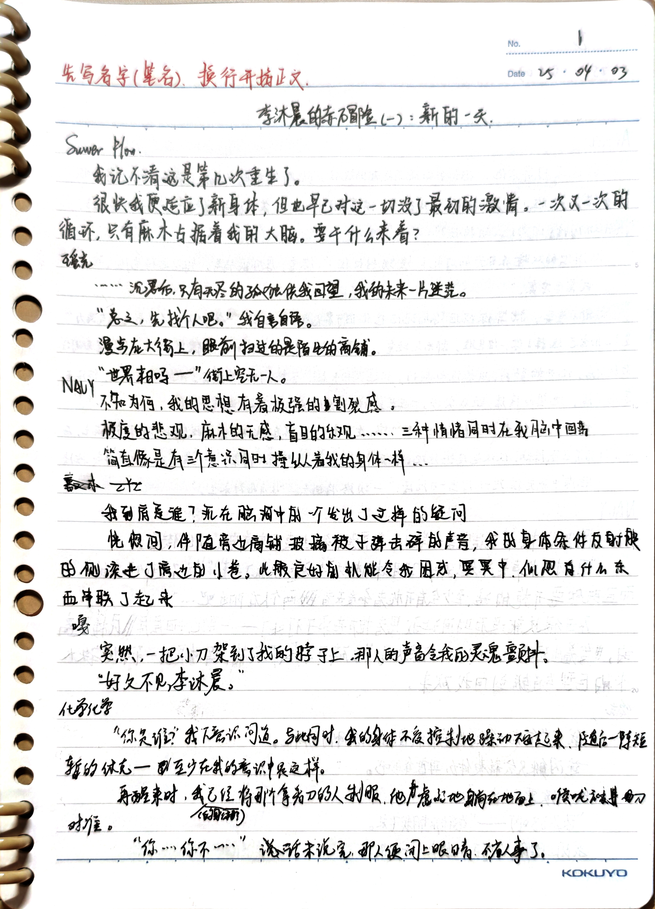
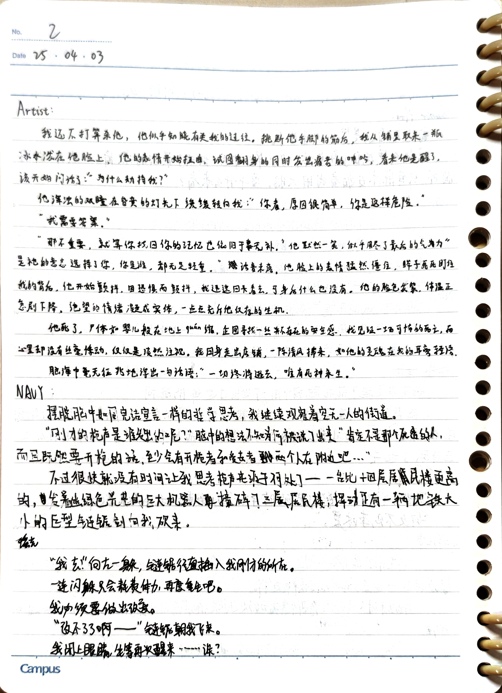
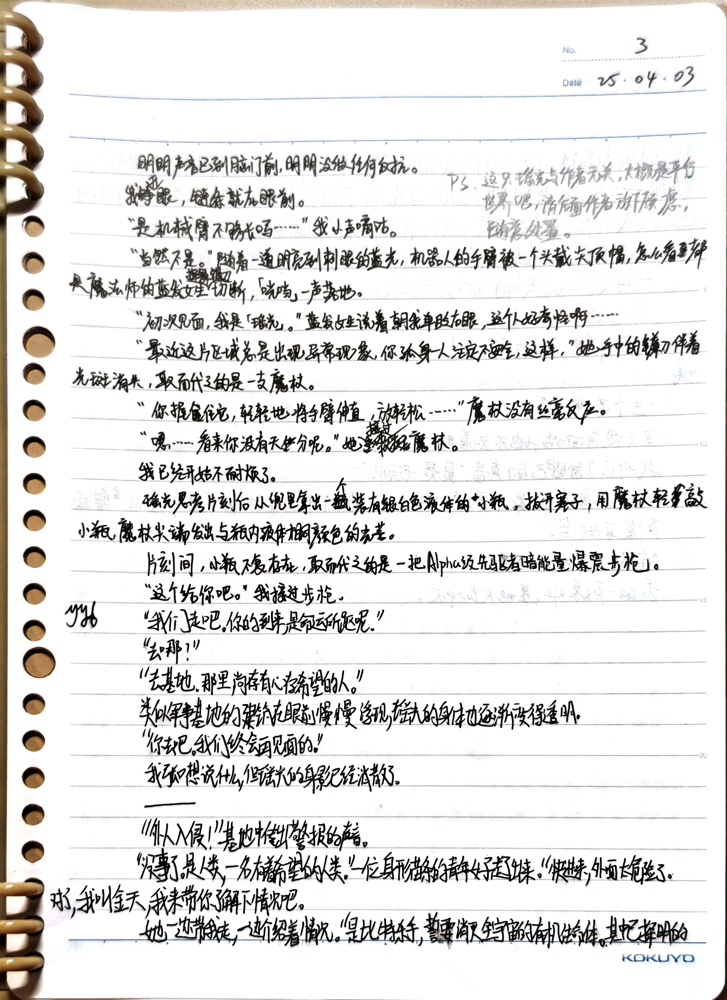
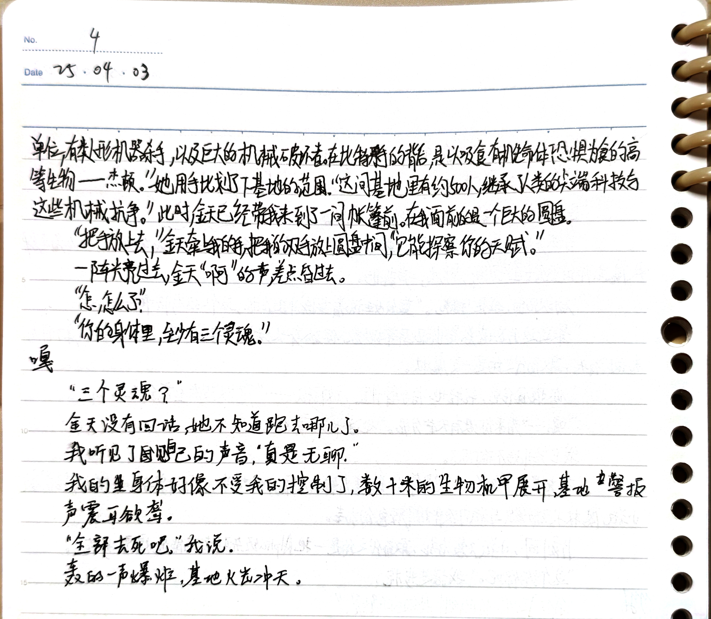

**Suwer Flow**

我记不清这是第几次重生了。

很快我便适应了新身体，但也早已对这一切没了最初的激情。一次又一次的循环，只有麻木占据着我的大脑。要干什么来着？

---

**瑶光**

……沉思后，只有无尽的孤独供我回望，我的未来一片迷茫。

“总之，先找个人吧。”我自言自语。

漫步在大街上，眼前扫过的是陌生的商铺。

“世界末日吗——”街上空无一人。

---

**NAUY**

不知为何，我的思想有着极强的割裂感。

极度的悲观，麻木的无感，盲目的乐观……三种情绪同时在我脑中回荡

简直像是有三个意识同时控制着我的身体一样……

---

**嘉木**

“我到底是谁？沉在脑海中的一个发出了这样的疑问。

恍惚间，伴随着商铺玻璃被子弹击碎的声音，我的身体条件反射般的侧滚进了旁边的小巷。此般良好的机能令我困惑，冥冥中，似乎有什么东西串联了起来。

---

**嘎**

突然，一把小刀架到了我的脖子上。那人的声音令我的灵魂颤抖。

> “好久不见，李沐晨。”

---

**化学化学**

“你是谁？”我不解地问道。与此同时，我的身体不受控制地躁动不安起来。随后一阵短暂的休克——至少在我的意识中是这样。

再醒来时，我（的身体？）已经将那个拿刀的人制服，他虚弱地躺在地面上，喉咙被刀对准。

“你……你不……”话未说完，那人便闭上眼睛，不省人事了。

---

**Artist**

我还真不打算杀他，他似乎知晓有关我的过往。挑断他手脚的筋后，我从铺里取来一瓶冰水泼在他脸上。他的表情开始扭曲，试图翻身的同时发出痛苦的呻吟，看来他是醒了，该开始问话了：“为什么折磨我？”

他浑浊的双瞳在昏黄的灯光下缓缓转向我：“你看，原因很简单，你是这样危险。”

“我需要答案。”

“那不重要，就算你找回你的记忆也依旧于事无补。”他咧嘴一笑，似乎用尽了最后的气力，“是衪的意志选择了你，你是谁，都无足轻重。”话音未落，他脸上的表情猛然僵住，眸子死死盯住我的背后，他开始颤抖，因恐惧而颤抖，我迅速回头看去，可身后什么也没有，他的脸色发紫，体温正急剧下降，绝望的情绪凝成实体，一点点充斥他仅存的生机。

他死了，尸体如婴儿般在地上蜷缩，企图寻找一丝并不存在的安全感，我见证一场可怖的死亡，而心里却没有丝毫悸动，仅仅是淡然注视，我回身走出店铺，一阵清风袭来，如他的灵魂在我耳旁轻语。

脑海中毫无征兆地浮出一句话语：“一切终将逝去，唯有死神永生。”

---

**NAUY**

摆脱脑海中如同完结宣言一样的哲学思考，我继续观察着空无一人的街道。

“刚才的枪声是谁发出的呢？”脑中的想法不知为何被说了出来，“肯定不是那个死透的人，而且既然要开枪的话，至少会有开枪者和受击者两个人在附近吧……”

不过很快就没有时间让我思考枪声来源于何处了——一台比十四层居民楼更高的，发着幽绿色光芒的巨大机器人撞碎了三层居民楼，挥动着足有一辆地铁大小的巨型链锯朝我砍来。

---

**瑶光**

“我去！”向左一躲，链锯径直插入我刚才的所在。

一连闪躲只会耗费体力，再度重生吧。

我必须要做出改变。

“改变不了了啊——”链锯朝我飞来。

我闭上眼睛，等待再次醒来……诶？

明明声音已到脑门前，明明没做任何反抗。

我睁开眼，链条就在眼前。

“是机械臂不够长吗……”我小声嘀咕。

“当然不是。”随着一道明亮刺眼的蓝光，机器人的手臂被一个头戴尖顶帽，怎么看都是魔法师的蓝发女生挥舞镰刀切断，哐当一声落地。

她轻盈地在我面前降落。

“初次见面，我是「瑶光」。”蓝发女生说着朝我单眨右眼，这个人好奇怪啊……

::: tip
这只瑶光与作者无关，大概是平行世界吧，请后面作者放下顾虑，随意处置。
:::

“最近这片区域总是出现异常现象，你孤身一人注定不安全，这样，”她手中的镰刀伴着光斑消失，取而代之的是一支魔杖。

“你握住它，轻轻地将手臂伸直，放轻松……”魔杖没有丝毫反应。

“嗯……看来你没有天分呢。”她接过魔杖。

我已经开始不耐烦了。

瑶光思考片刻后从兜里拿出一个装有银白色液体的小瓶，拔开塞子，用魔杖轻敲小瓶，魔杖尖端发出与瓶内液体相同的颜色的光芒。

---

**NAUY**

片刻间，小瓶不复存在，取而代之的是一把Alpha级先驱者能量爆破步枪。

“这个给你吧。”我接过步枪。

---

**yyl**

“我们走吧，你的到来是命运所驱呢。”

“去哪？”

“去基地，那里尚存有心存希望的人。”

类似军事基地的建筑在眼前慢慢浮现，瑶光的身体也逐渐变得透明。

“你去吧，我们终会再见面的。”

我想说什么，但瑶光的身影已经消失了。

——

“外人入侵！”基地中传来警报的声音。

“没事了，是人类，一名有着希望的人。”一位身形苗条的青年女子走出来，“快进来，外面太危险了。对了，我叫金天，我来带你了解下情况吧。”

她一边带我走，一边介绍着情况。“是比特杀手，誓要消灭全宇宙的有机生命体。其中已探明的单位，有类人型机器杀手，以及巨大的机械破坏者。在比特杀手的背后，是以吸食有机生命体恐惧为食的高等生物——杰顿。”她用手比划了下基地的范围，“这间基地里有约500人，继承了人类的尖端科技与这些机械抗争。”此时，金天已经带我来到了一间帐篷前，在我面前的是一个巨大的圆盘。

“把手放上去。”金天牵着我的手把我的双手放上圆盘中间，“它能探察你的天赋。”

一阵光亮过去，金天“啊”的一声，差点昏过去。

“怎，怎么了？”

“你的身体里，至少有三个灵魂！”

---

**嘎**

“三个灵魂？”

金天没有回话，她不知道跑去哪儿了。

我听见了自己的声音，“真是无聊。”

我的身体好像不受我的控制了，数十米的生物机甲展开，基地的警报声震耳欲聋。

“全部去死吧。”我说。

轰的一声爆炸，基地火光冲天。

:::details 1~4

:::
