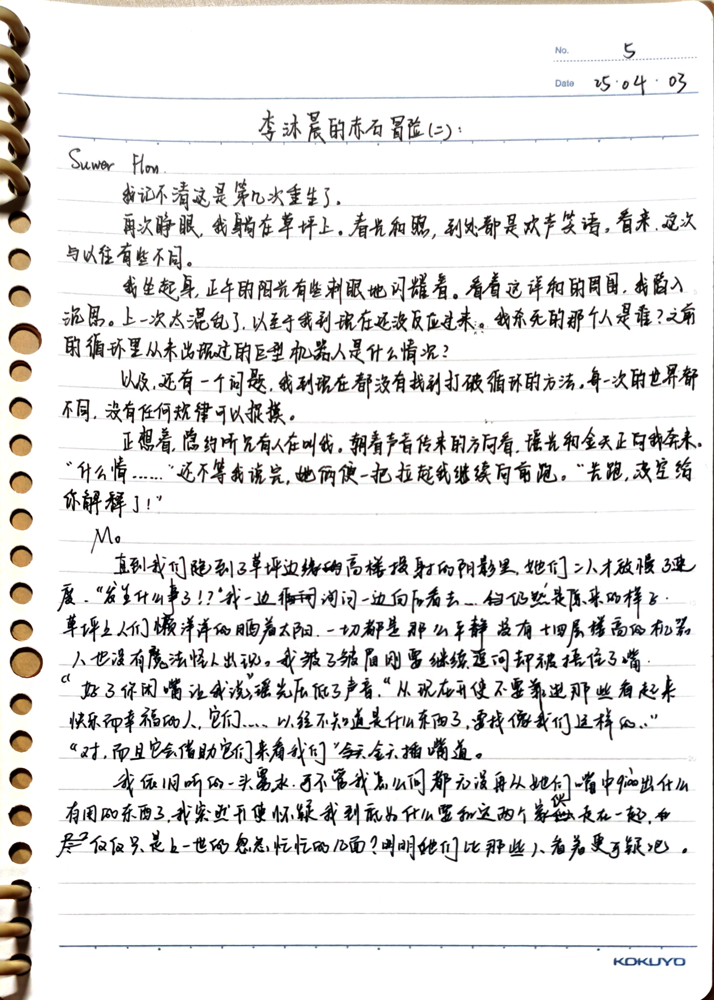

**Suwer Flow**

我记不清这是第几次重生了。

再次睁眼，我躺在草坪上。春光和煦，到处都是欢声笑语，看来，这次与以往有些不同。

我坐起身，正午的阳光有些刺眼地闪耀着。看着这祥和的周围，我陷入沉思。上一次太混乱了，以至于我到现在还没反应过来。我杀死的那个人是谁？之前的循环里从未出现过的巨型机器人是什么情况？

以及，还有一个问题，我到现在都没有找到打破循环的方法。每一次的世界都不同，没有任何规律可以捉摸。

正想着，隐约听见有人在叫我。朝着声音传来的方向看，瑶光和金天正向我奔来。

“什么情……”还不等我说完，她俩便一把拉起我继续向前跑。“快跑，没空给你解释了！”

---

**Mo**

直到我们跑到了草坪边缘的高楼投射的阴影里，她们二人才放慢了脚步。“发生什么事了！？”我一边询问一边向后看去……仍然是原来的样子，草坪上人们懒洋洋地晒着太阳，一切都是那么平静，没有十四层楼高的机器人，也没有魔法怪人出现。我皱了皱眉刚要继续追问却被捂住了嘴。

“好了你闭嘴让我讲。”瑶光压低了声音，“从现在开始不要靠近那些看起来快乐而幸福的人，它们……已经不知道是什么东西了，要找像我们这样的。”

“对，而且它会借助它们来看我们。”金天插嘴道。

我依旧听的一头雾水，可不管我怎么问都无法再从她们嘴中撬出什么有用的东西了。我突然开始怀疑我到底为什么要和这两个家伙走在一起，仅仅是上一世的匆匆忙忙的几面？明明她们比那些人看着更可疑吧。

:::details 5

:::